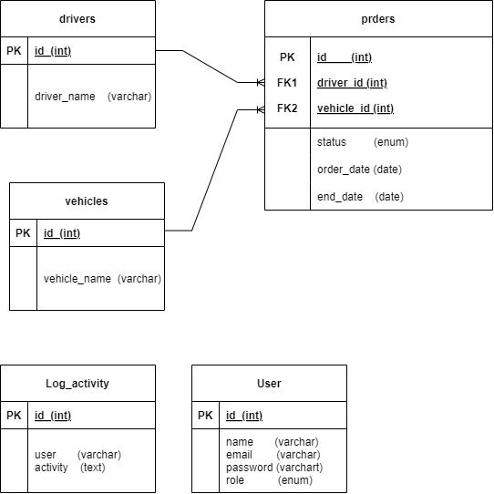

        

### Description

1. **Users**
   - id (Primary Key)
   - name
   - email
   - password
   - role (enum[admin, approver1, approver2])

2. **Drivers**
   - id (Primary Key)
   - driver_name

3. **Vehicles**
   - id (Primary Key)
   - vehicle_name
   
4. **Orders**
   - id (Primary Key)
   - driver_id (Foreign Key)
   - vehicle_id (Foreign Key)
   - status (enum[pending, approved1, approved2, rejected, done])
   - order_date
   - end_date

5. **Log Activities**
   - id (Primary Key)
   - user
   - activity

 

### Database Relations

1. **Drivers - Orders**
   - Relasi One-to-Many: Seorang driver dapat terkait dengan banyak pesanan, tetapi setiap pesanan hanya dapat terkait dengan satu driver.

2. **Vehicles - Orders**
   - Relasi One-to-Many: Sebuah kendaraan dapat terkait dengan banyak pesanan, tetapi setiap pesanan hanya dapat terkait dengan satu kendaraan.
